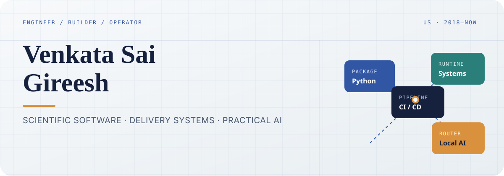

<div align="center">
  
</div>

<br />

I build the connective tissue between **scientific software, reliable delivery, and practical AI systems**—from Python packages and release pipelines to local-first agent workflows.

My bias is toward tools that are reproducible, inspectable, and useful outside the demo.

<p>
  <a href="https://github.com/cvsgireesh?tab=repositories"></a>
  <a href="https://github.com/cvsgireesh?tab=followers"></a>
</p>

---

### Current working set

| Focus | What that means in practice |
| :--- | :--- |
| **Scientific Python** | Packaging, PyPI and Conda distribution, Array API work, and accelerated compute workflows |
| **Delivery systems** | Cross-platform builds, automated testing, release pipelines, and dependable developer tooling |
| **Local-first AI** | Private-by-default inference, human-supervised agents, and deliberate local/cloud routing |
| **Systems engineering** | Linux internals, distributed systems, and the layers beneath high-level applications |

### Selected systems

<table>
  <tr>
    <td width="50%" valign="top">
      <h4><a href="https://github.com/cvsgireesh/llm-way-split">llm-way-split</a></h4>
      <p>Local-first mobile bill splitting with OCR and deterministic reconciliation.</p>
      <code>Python</code> · <code>FastAPI</code> · <code>Ollama</code>
    </td>
    <td width="50%" valign="top">
      <h4><a href="https://github.com/cvsgireesh/hermes-hybrid-agent-router">hermes-hybrid-agent-router</a></h4>
      <p>Routes work between local models and authority models for cost, privacy, and verification.</p>
      <code>Shell</code> · <code>llama.cpp</code> · <code>Codex</code>
    </td>
  </tr>
  <tr>
    <td width="50%" valign="top">
      <h4><a href="https://github.com/cvsgireesh/buzz-agent-team-starter-pack">buzz-agent-team-starter-pack</a></h4>
      <p>Validated agent personas, team templates, and safe deployment helpers with human oversight.</p>
      <code>Python</code> · <code>Agents</code> · <code>Workflows</code>
    </td>
    <td width="50%" valign="top">
      <h4><a href="https://github.com/cvsgireesh/Linux-Device-Drivers">Linux-Device-Drivers</a></h4>
      <p>Advanced systems programming exercises focused on Linux device-driver fundamentals.</p>
      <code>C</code> · <code>Linux</code> · <code>Systems</code>
    </td>
  </tr>
</table>

### Tools I reach for

<p>
  
  
  
  
  
  
  
  
</p>

```text
design constraint  →  explicit trade-off  →  repeatable build  →  observable result
```

<sub>Based in the United States · Building in public since 2018</sub>
